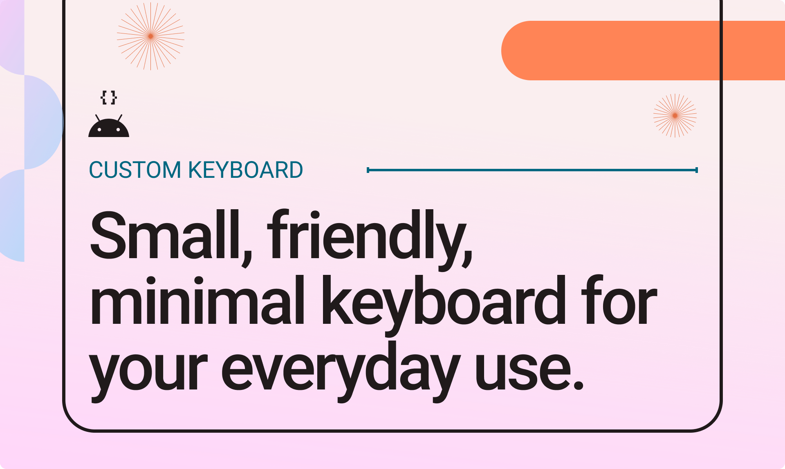
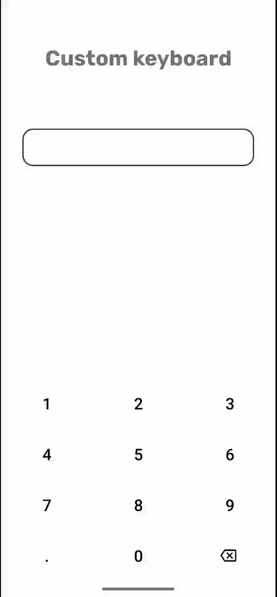
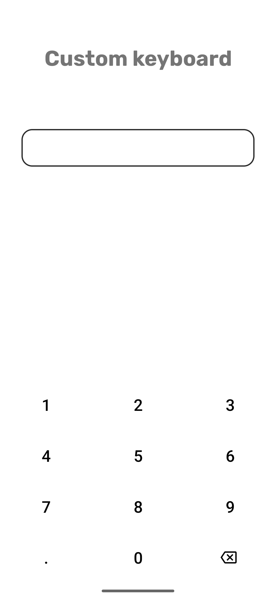
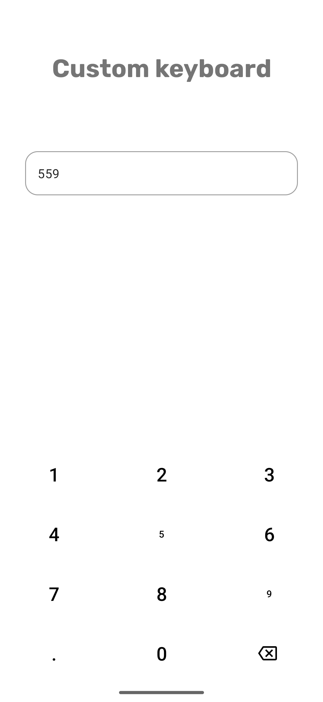
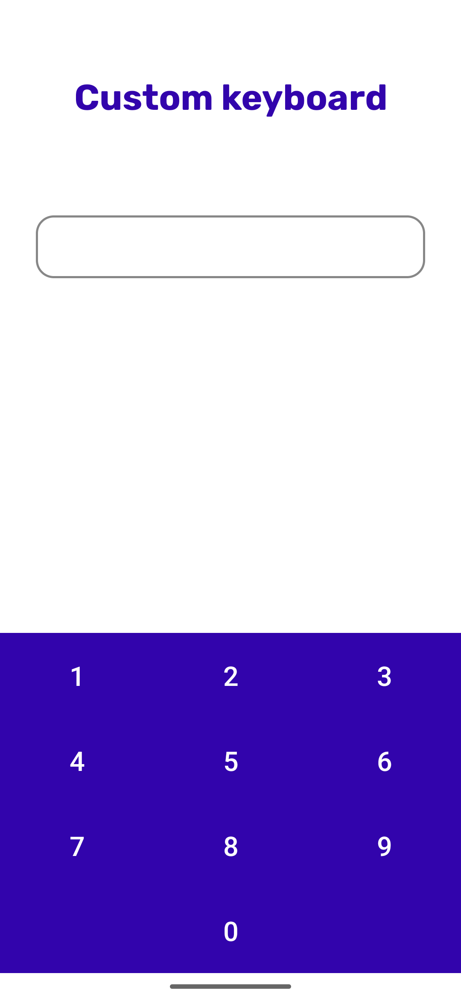

# Custom Keyboard
Add a keyboard experience to your app just like PhonePe, GPay etc. Easy to use & bloat free!  



# Features
- Haptic feedback on touch
- Animating keys (scale animation currently)
- Clear (Delete) key support
- Dot (Decimal) key support
- Change keyboard parameters like key color, keyboard color, key font etc.

# Screenshot
<p>



</p>


# Usage
- Add repository dependency in root `build.gradle`:
```
allprojects {
	repositories {
		...
		maven { url 'https://jitpack.io' }
	}
}
```
- Add library dependency in app `build.gradle`:
```
dependencies {
    implementation 'com.github.Damercy:CustomKeyboard:2.0.0'
}
```
- Add layout in resource file:
```xml
<?xml version="1.0" encoding="utf-8"?>
<RelativeLayout xmlns:android="http://schemas.android.com/apk/res/android"
    android:layout_width="match_parent"
    android:layout_height="match_parent">

    /* Other layout files*/

    <EditText android:id="@+id/etInput" 
        android:layout_width="match_parent"
        android:layout_height="wrap_content" />

    <dev.dayaonweb.openime.customkeyboard.Keyboard
        android:id="@+id/keyboard"
        android:layout_width="match_parent"
        android:layout_height="wrap_content"
        android:layout_alignParentBottom="true" />

</RelativeLayout>
```
- Setup the custom keyboard by passing the input connection of the corresponding edit text:
```kotlin
class MainActivity : AppCompatActivity() {

    private lateinit var inputEditText: EditText
    private lateinit var keyboard: Keyboard

    override fun onCreate(savedInstanceState: Bundle?) {
        super.onCreate(savedInstanceState)
        setContentView(R.layout.activity_main)

        // hook views
        inputEditText = findViewById(R.id.etInput)
        keyboard = findViewById(R.id.keyboard)

        // prevent system keyboard from appearing when EditText is tapped
        inputEditText.showSoftInputOnFocus = false

        // pass the InputConnection from the EditText to the keyboard
        val inputConnection = inputEditText.onCreateInputConnection(EditorInfo())
        keyboard.setInputConnection(inputConnection)

    }
}
```

# Customizing
## XML
- `textColor` - Change color of the keys in the keyboard
- `backgroundColor` - Change background color of the keyboard
- `textFont` - Change font family of the keys in the keyboard
- `isClearVisible` - Toggle clear (delete) key visibility
- `isDotVisible` - Toggle dot (decimal) key visibility
- `clearDrawable` - Change clear (delete) icon
- `clearDrawableColor` - Change clear (delete) icon color
- `hapticsEnabled` -Toggle if haptic feedback should be enabled or not
- `animationEnabled` - Toggle if key press animation should be enabled or not

## In code
- `setClearDrawableColor(colorRes:Int)`
- `setClearDrawable(drawableRes:Int)`
- `setTextFont(fontRes:Int)`
- `setDotAvailable(isAvailable:Boolean)`
- `setKeyboardBackgroundColor(color:Int)`
- `setInputTextColor(colorRes:Int)`
- `setClearAvailable(isAvailable:Boolean)`
- `setHaptic(isEnabled: Boolean)`
- `setAnimationEnabled(isEnabled: Boolean)`

### Give it a ⭐ if you liked it 😄
