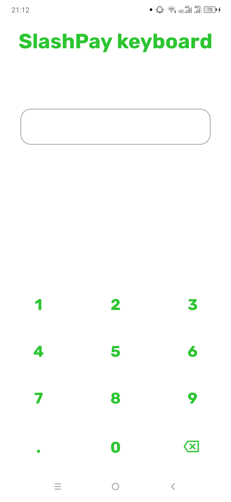
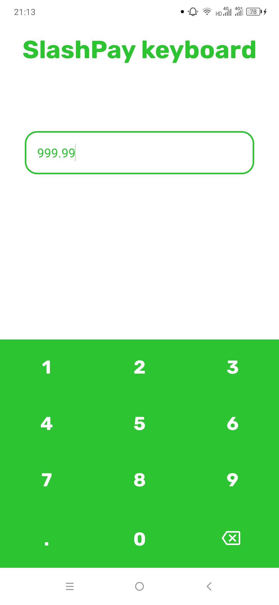

# SlashKeyboard
Custom input keyboard that you can customize!

<p float="left">
  
  
</p>

### Usage 
First setup in your layout SlashKeyboard as follows:
```xml
<?xml version="1.0" encoding="utf-8"?>
<RelativeLayout xmlns:android="http://schemas.android.com/apk/res/android"
    xmlns:app="http://schemas.android.com/apk/res-auto"
    xmlns:tools="http://schemas.android.com/tools"
    android:layout_width="match_parent"
    android:layout_height="match_parent"
    tools:context=".MainActivity">

      /* Other layout files*/
  
    <EditText
        android:id="@+id/etInput"
        android:layout_width="match_parent"
        android:layout_height="wrap_content"/>
    
    <com.dayaonweb.slashinput.SlashInputKeyboard
        android:id="@+id/keyboard"
        android:layout_width="match_parent"
        android:layout_height="wrap_content"
        android:layout_alignParentBottom="true" />

</RelativeLayout>
```

Then setup SlashKeyboard & pass in input connection from corresponding edit text as shown below:
```kotlin
class MainActivity : AppCompatActivity() {

    private lateinit var inputEditText: EditText
    private lateinit var keyboard: SlashInputKeyboard

    override fun onCreate(savedInstanceState: Bundle?) {
        super.onCreate(savedInstanceState)
        setContentView(R.layout.activity_main)

        // hook views
        inputEditText = findViewById(R.id.etInput)
        keyboard = findViewById(R.id.keyboard)

        // prevent system keyboard from appearing when EditText is tapped
        inputEditText.showSoftInputOnFocus = false

        // pass the InputConnection from the EditText to the keyboard
        val inputConnection = inputEditText.onCreateInputConnection(EditorInfo())
        keyboard.setInputConnection(inputConnection)

    }
}
```

### Customizing
> XML
- `textColor` - Change color of the keys in the keyboard
- `backgroundColor` - Change background color of the keyboard
- `textFont` - Change font family of the keys in the keyboard
- `isClearVisible` - Toggle clear (delete) key visibility
- `isDotVisible` - Toggle dot (decimal) key visibility
- `clearDrawable` - Change clear (delete) icon
- `clearDrawableColor` - Change clear (delete) icon color

> Java (in code)  

- `setClearDrawableColor(colorRes:Int)`
- `setClearDrawable(drawableRes:Int)`
- `setTextFont(fontRes:Int)`
- `setDotAvailable(isAvailable:Boolean)`
- `setKeyboardBackgroundColor(color:Int)`
- `setInputTextColor(colorRes:Int)`
- `setClearAvailable(isAvailable:Boolean)`


### Give it a ⭐ if you liked it 😄
